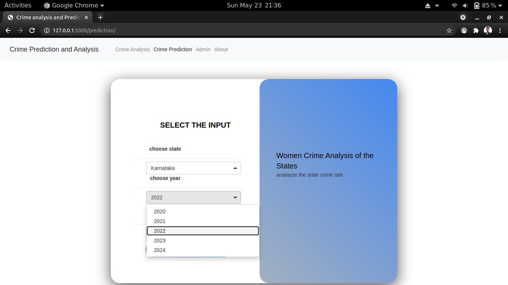
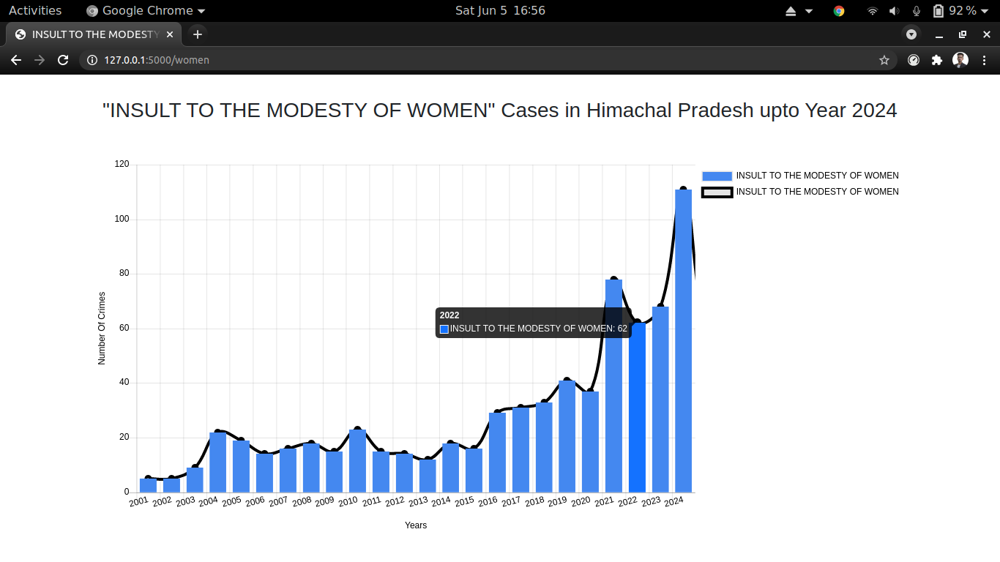
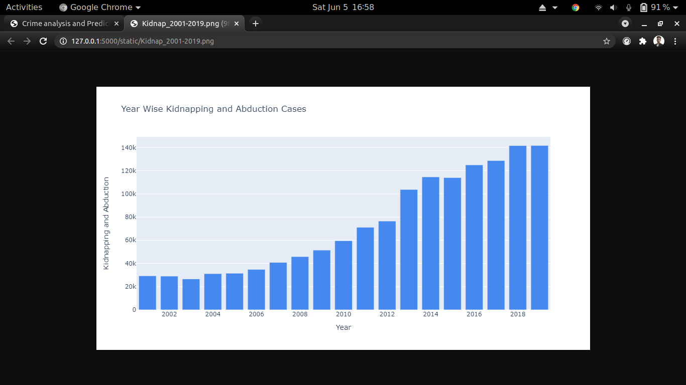
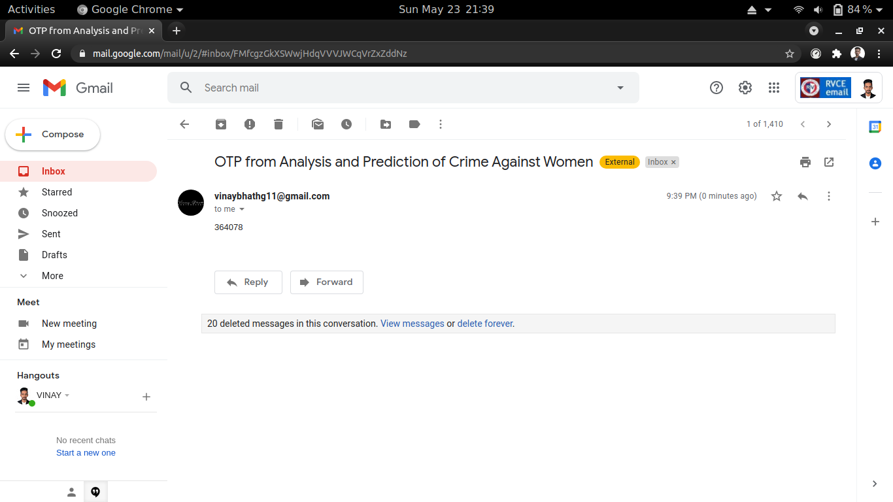

# Analysis-and-Prediction-of-Crimes-Against-Women-using-Machine-Learning-Algorithms

In India, according to National Commission for Women(NCW), 23,722 complaints of crimes
against women were received in 2020, the highest in the last six years. It is a big threat to humanity
and in some parts of India, women are still treated as prisoners. Violence against women is perhaps
as old as mankind. Not only in rural areas of India but also in urban areas women face a lot of
problems like dowry, trafficking, acid attacks, miscarriage, kidnapping, and abduction of women.
Crime against women is majorly happening because of the inefficient legal justice system, weak
rules of law, crime prediction, and criminal identification. There is need to analyse and predict the
crime rate and the necessary steps to be taken further by the government officials to avoid the
increase in threats and crime against women.


The proposed work is a web application built using MVC architecture which predicts the crime rate
against women using features present in the dataset, the dataset is extracted from the Indian
government official site National Crime Records Bureau(NCRB). The various task to be undertaken
are pre-processing of the data, selecting the algorithm, training the dataset with algorithm,
evaluating with test data and classifying the type of crime which will occur in a particular area with
the help of a machine learning algorithm using python as core.


The analysis and prediction of crimes against women using machine learning algorithms will help
women to create awareness among themselves and avoid traveling to a certain area at a particular
time. By using this web application, the user will get to know the statistics and occurrence of crimes
in a particular area with visualization of different categories of crime rates against women. Also,
police can increase their patrol force in a particular area where crime rates are high and can reduce
the rate of crime against women. Gradually, the rate of crime against women can be reduced with
help of police, hoping India will be a better living place for women.

# Features 
1) Prediction of different crime rate against women in India till year 2024.

2) State, year, different types of crime rate analysis.

3) Update with latest dataset by giving admin previlages 

4) Email verification, forgot password feature to admin.

# Screen Shots

Reading the input from user


Prediction of crime


Crime analysis


Authentication of admin email



# Tech stack
1) Python3 for machine learning model linear regression

2) MongoDB for storing all the admin details

3) JavaScript, HTML5, CSS, BootStrap for frontend design

# Setup For Linux

Python3 Installation

update the system using 
``` sudo apt update```

Install python3 
``` sudo apt install python3.8```

MongoDB Installation

Import the public key used by the package management system
``` wget -qO - https://www.mongodb.org/static/pgp/server-5.0.asc | sudo apt-key add - ```

Create a list file for MongoDB
``` echo "deb [ arch=amd64,arm64 ] https://repo.mongodb.org/apt/ubuntu focal/mongodb-org/5.0 multiverse" | sudo tee /etc/apt/sources.list.d/mongodb-org-5.0.list```

Reload local package database
``` sudo apt-get update ```

Install the MongoDB packages
``` sudo apt-get install -y mongodb-org ```


